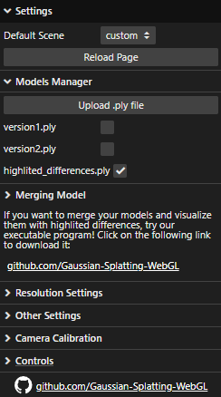

# WebGL 3D Gaussian Splatting Renderer

#### Acknoledgement

This repository is a fork of the original project [Gaussian-Splatting-WebGL](https://github.com/kishimisu/Gaussian-Splatting-WebGL), which has been extended as part of a university project to include additional features and functionalities. The project is a request for the course course [Augmented and Virtual Reality](https://corsi.unige.it/off.f/2023/ins/66562) during Master's degree in Computer Engineering - Artifical Intelligence at the University of Genova.

I acknowledge the efforts of the original authors and their contribution as the foundation for this work. All modifications and updates introduced here aim to align with the original code structure and project goals while meeting specific academic requirements.

## Overview

Javascript and WebGL2 implementation of a 3D gaussian rasterizer based on the paper [3D Gaussian Splatting
for Real-Time Radiance Field Rendering](https://repo-sam.inria.fr/fungraph/3d-gaussian-splatting/).

I tried to match as closely as possible the original C++/CUDA implementation (which is split into multiple repositories) so that the question "where are these calculations coming from?" can easily be answered when looking through the code.

## 🆕 New Features: Models Manager Extension

As part of this extension, a new folder called **"Models Manager"** has been added within the existing GUI. This section introduces new functionalities for handling multiple Gaussian Splatting models:

- **Upload PLY File Button**: A new button allows users to upload a `.ply` file containing a Gaussian Splatting model.
- **Model Selection Checkboxes**: Once a `.ply` file is uploaded, checkboxes appear corresponding to each uploaded file, allowing users to select which model to visualize.
- **Multi-Model Support**: Users can add multiple models simultaneously and switch between them using the provided checkboxes.
- **Model Removal**: To remove all uploaded models, simply press the **"Reload Page"** button.

These enhancements improve interactivity and flexibility in viewing different Gaussian Splatting models dynamically.

### 🖼️ Models Manager GUI Preview

Below is a preview of the updated **Models Manager** interface:
  

## 🌐 Live Demo

🚀 Experience the project in action!  
👉 [Click here to try the live demo!](https://biaperass.github.io/Gaussian-Splatting-WebGL/)  

## Background

I wanted to get a better understanding on how 3D gaussians splats are used in rasterization pipelines to achieve real time results, so I tried to reimplement the rendering algorithm in a framework I'm familiar with (WebGL).
The next step if I find the time will be to make a WebGPU version too in order to compare the performances.

## NeRFs and Gaussian Splatting

(WIP)

## Implementation Details

In this implementation, each gaussian is processed by a vertex shader to create a screen-space bounding rectangle made of 4 vertices, which is then colorized using a fragment shader.

#### Scale, Rotation, 3D covariance

In the original implementation, the scale and rotation attributes for each gaussian are sent to the GPU in order to calculate its 3D covariance matrix, which is ultimately used to compute its screen-space bouding rectangle. This allow to dynamically resize the splats for visualization purposes.

In this implementation, the 3D covariance is pre-computed as a one-time operation to avoid recomputing it at each frame, and also avoid sending the scale and rotation attributes to the GPU.
The splat size parameter is used differently to still allow to dynamically resize the splats 

#### Harmonics

The gaussians don't have a "color" attribute, instead their color is encoded using 16 spherical harmonics (that are vectors of 3 components). This allow for a more realistic view-dependant lighting, however it needs 48 floats per gaussian which is huge for scenes that typically have millions of gaussians.
Fortunately, not all of the harmonics coefficients are necessary to compute the final color, using more will only increase the accuracy. Here are the different degrees we can use:

- Degree 3: 16 harmonics (48 floats) per gaussian
- Degree 2: 9 harmonics (27 floats) per gaussian
- Degree 1: 4 harmonics (12 floats) per gaussian
- Degree 0: 1 harmonic (3 floats) per gaussian [no view-dependant lighting]

All degrees above 0 are view-dependant and the color for each gaussian needs to be recomputed each time the view matrix is updated.
Using degree 0 for this implementation is clearly the best in term of performances as it avoid sending any spherical harmonic to the GPU, and allow to pre-compute the gaussian color as a one-time operation before rendering.
The visual impact is clearly negligible compared to the performance gain.

#### Sorting

(WIP)

## Code Structure

src/
- **main.js**: Setup and render
- **loader.js**: Load and pre-process a .ply file containing gaussian data
- **worker-sort.js**: Web Worker that sorts gaussian splats by depth
- **camera.js**: Camera manager

- **utils.js**: WebGL & utilities

shaders/
- **splat_vertex.glsl**: vertex shader that processes 4 vertices per gaussian to compute its 2d bounding quad

- **splat_fragment.glsl**: fragment shader that processes and colorize all pixels for each gaussian

## Reference

- [Original paper](https://repo-sam.inria.fr/fungraph/3d-gaussian-splatting/) (3D Gaussian Splatting
for Real-Time Radiance Field Rendering)

- [Webgl Splat Renderer by antimatter15](https://github.com/antimatter15/splat): clean and concise implementation with no external library from which are coming many optimizations related to sorting (web-worker, view matrix difference treshold, count sort)
